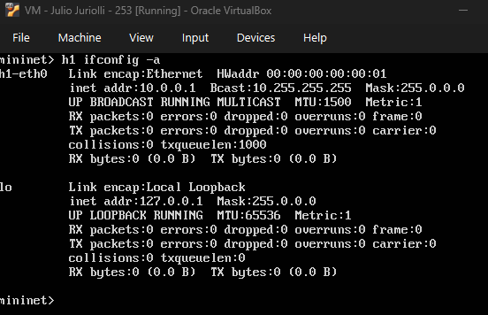
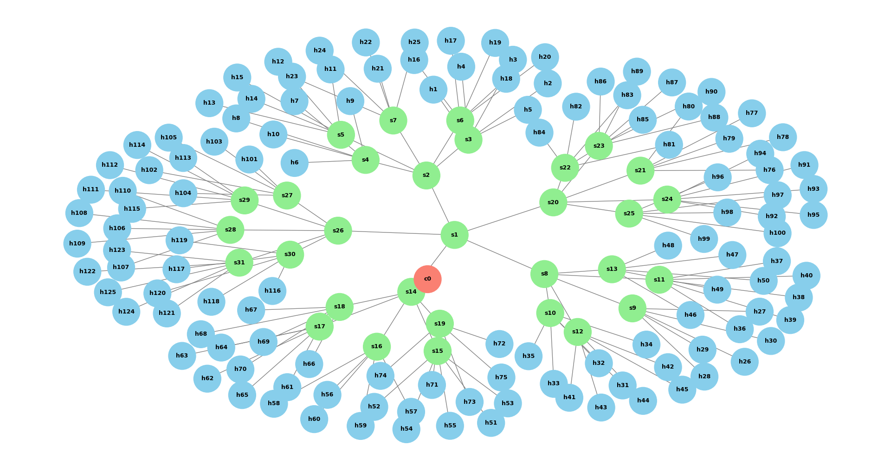
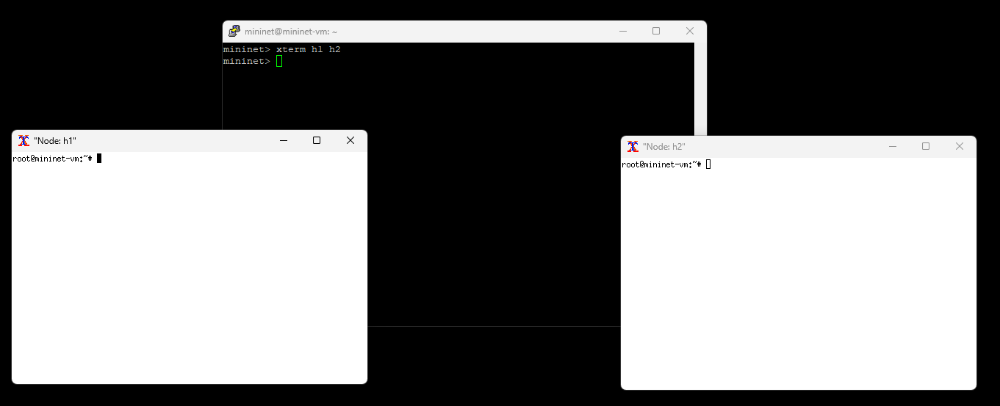
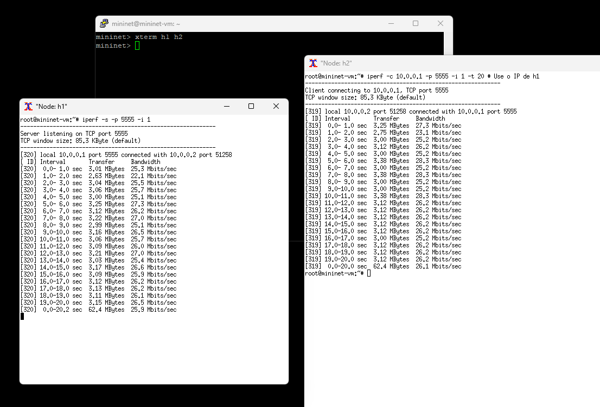
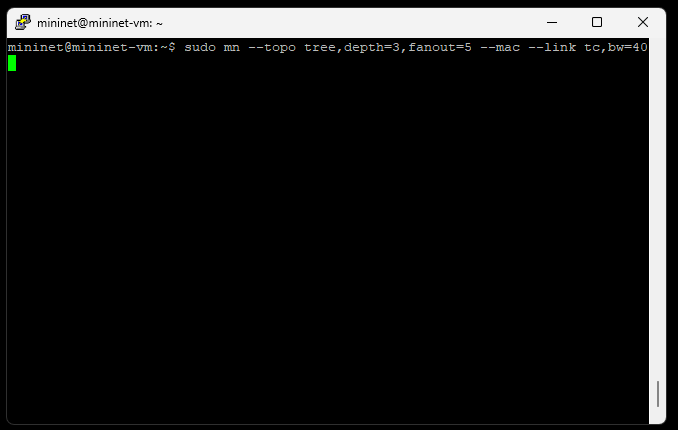
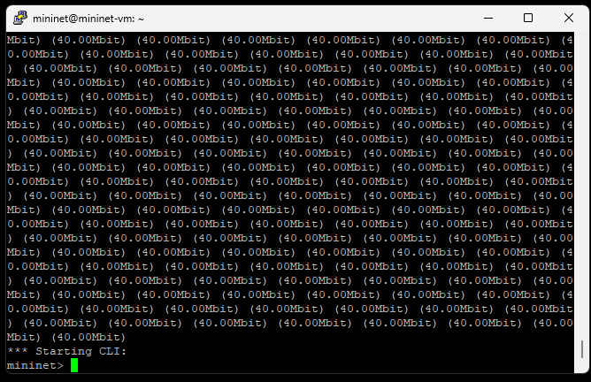
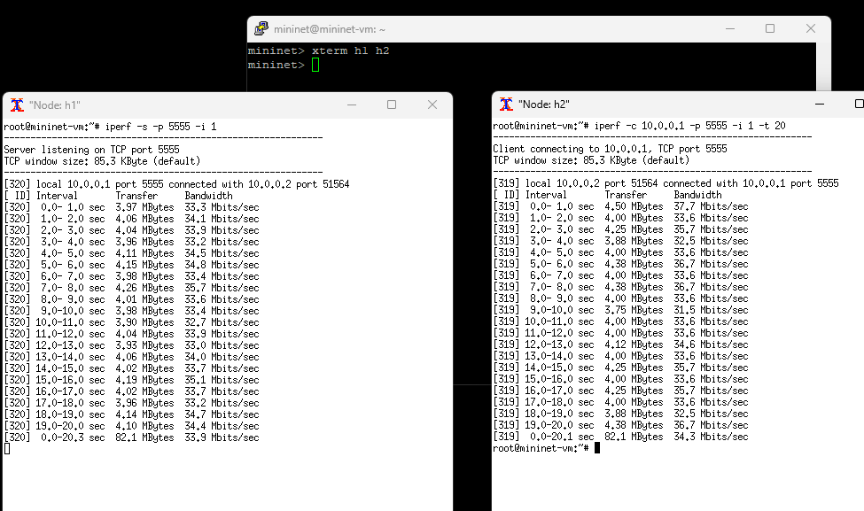

# Exercício 1

| Considerar uma topologia árvore com profundidade de três e ramificação de cinco.

### a) Criar uma topologia com largura de banda 30Mbps e controlador mininet

- Topologia tree com depth 3 e fanout 5
- MAC padronizado --mac
- Largura de banda 30Mbps usando `--link tc,bw=30`


```bash
sudo mn --topo tree,depth=3,fanout=5 --mac --link tc,bw=30
```

| Resultado:


<br>


<br>


### b) Inspecionando a rede

| Comando `nodes` para mostrar os nós da rede


| Comando `net` para verificar as conexões entre os nós da rede (todo o resultado do comando)


<br> 


<br> 


<br> 


<br> 


<br> 


<br> 


| Comando `ifconfig` para ver informações específicas de um nó



### c) Ilustração da topologia da rede 



### d) Testes de ping 

Para os testes de ping, foi utilizado o xterm, para simulação de host 1 e host 2. Além disso, foi utilizado o comando tcpdump





### e) Testes com servidor TCP




| Alterando a topologia da rede (criando uma rede nova, com as mesmas configurações, porém com 40MBps)






| Executando o iperf na rede de 40MBps

