# Exercício 1

| Considerar uma topologia árvore com profundidade de três e ramificação de cinco.

### a) Criar uma topologia com largura de banda 30Mbps e controlador mininet

- Topologia tree com depth 3 e fanout 5
- MAC padronizado --mac
- Largura de banda 30Mbps usando `--link tc,bw=30`


```bash
sudo mn --topo tree,depth=3,fanout=5 --mac --link tc,bw=30
```

| Resultado:

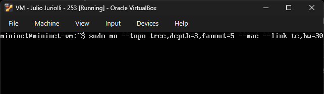

<br>

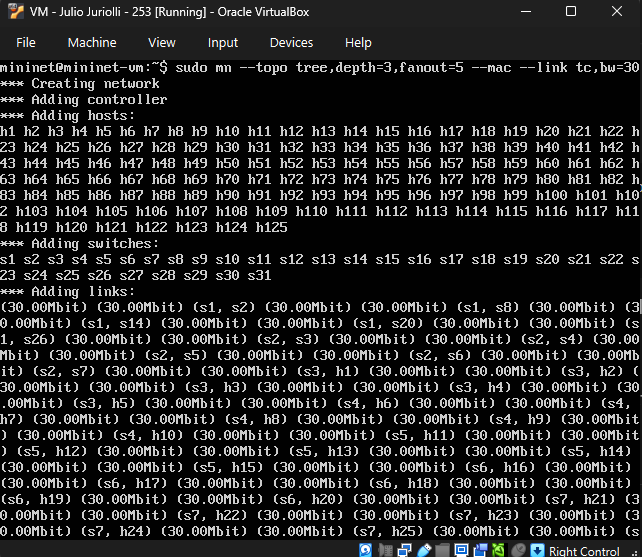

<br>

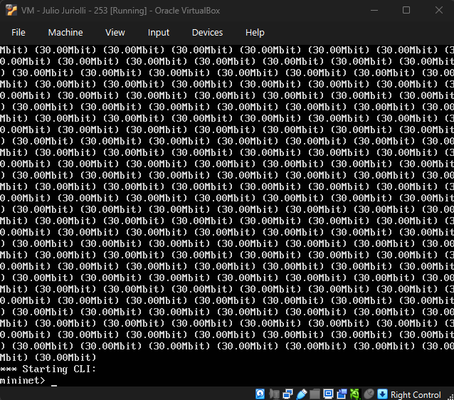

### b) Inspecionando a rede

| Comando `nodes` para mostrar os nós da rede

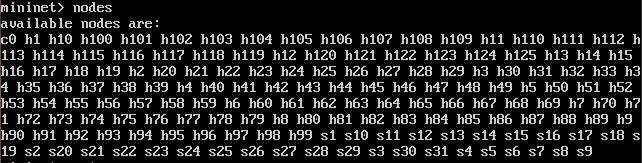

| Comando `net` para verificar as conexões entre os nós da rede (todo o resultado do comando)


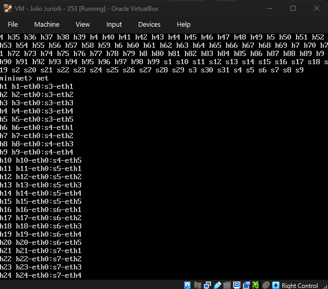

<br> 

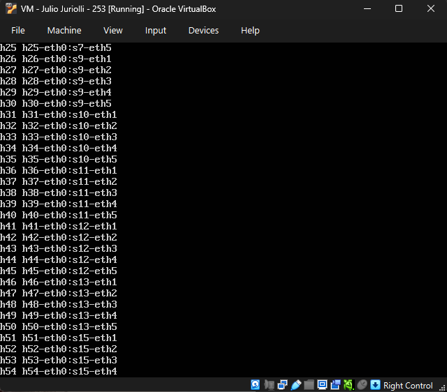

<br> 

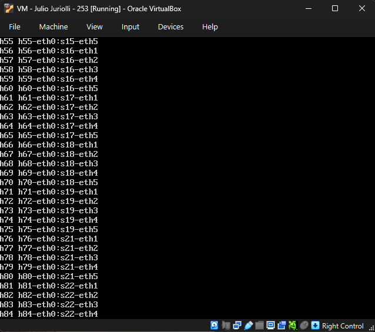

<br> 

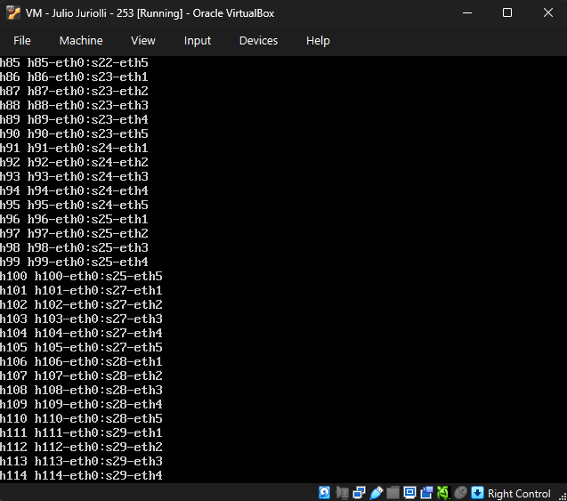

<br> 

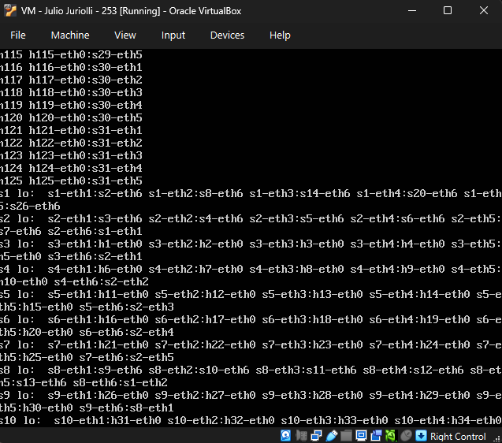

<br> 

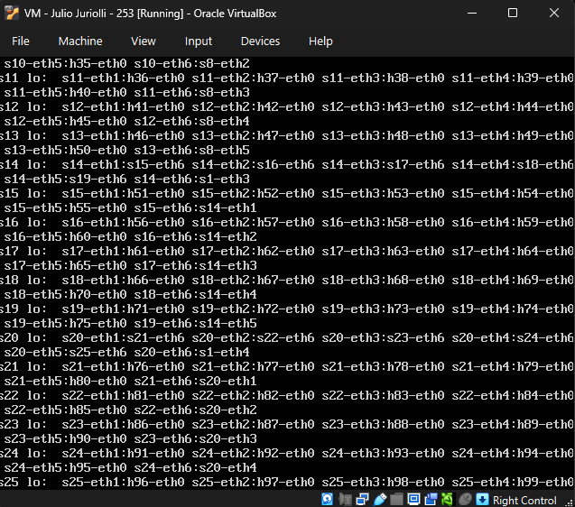

<br> 

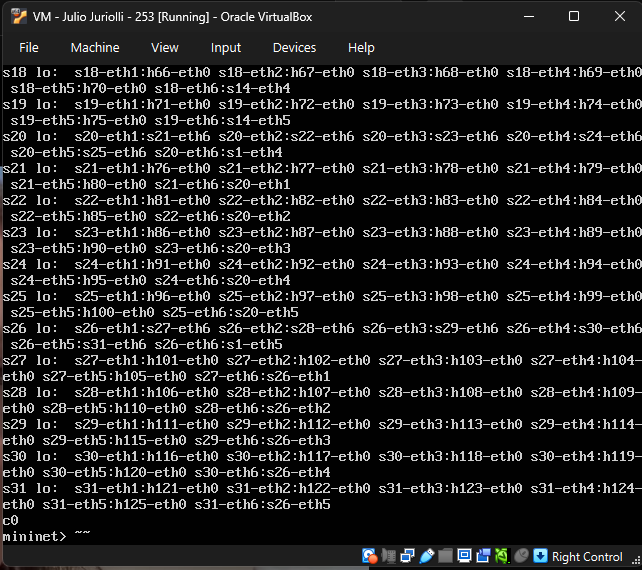

