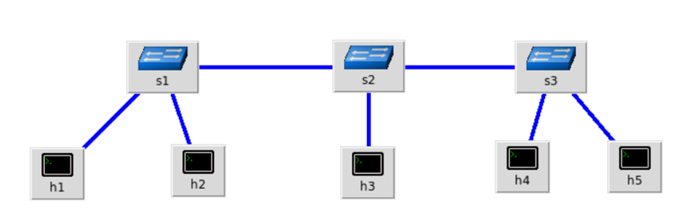
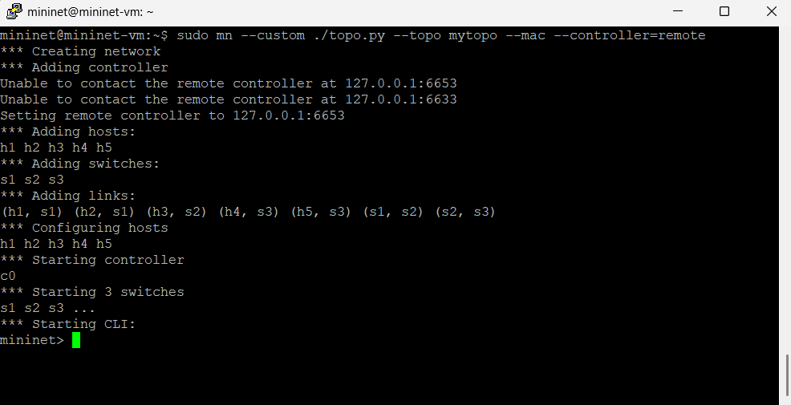
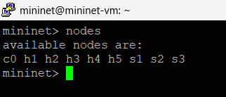
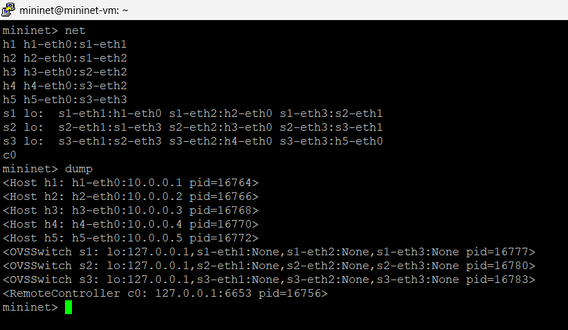
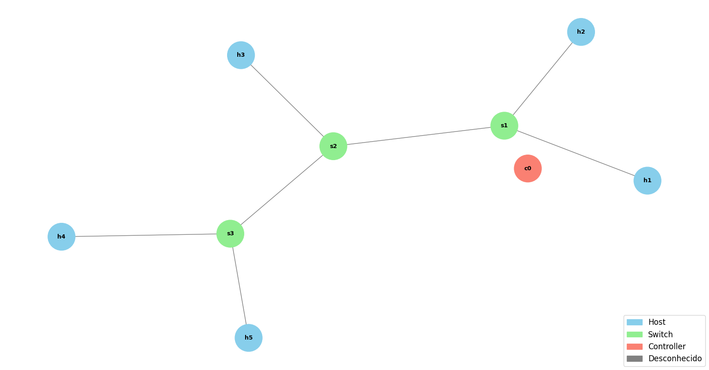
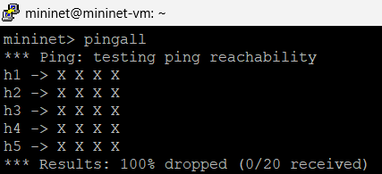
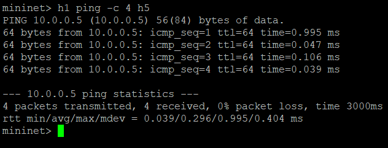
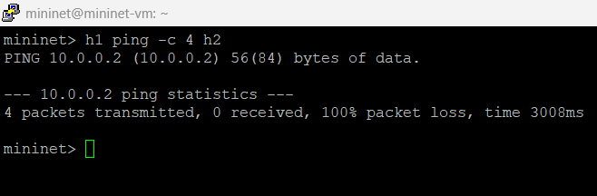

# Exercício 2
| Criar um código python para a topologia

### a) Criar uma topologia customizada considerando controlador manual e MAC padronizado

[Arquivo python criado para a topologia (topo.py)](./topo.py)

### b) Inspeção das informações da rede:

### c) Desenho ilustrativo da topologia

### d) Testes de ping

### e) Criação das novas regras para os nós 

### f) Testes de ping 

